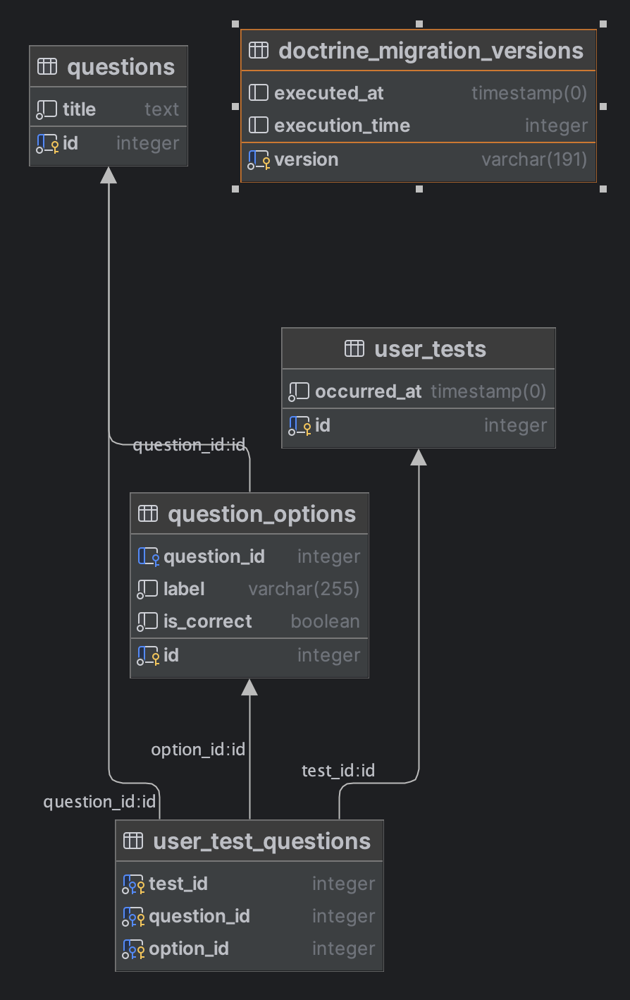

# Symfony Docker
> Пример использования Symfony v.6.2 (PHP 8.2) с Docker-Compose.

## Как работать с этим проектом?

Для работы с этим проектом вам не потребуется ставить что-то дополнительное, кроме как Docker & Docker-Compose на свою локальную машину!
> Если ваш компьютер или ОС не поддерживает Docker, вы всегда сможете развернуть все вручную. Но вам придется обзавестись файлом .env.local.

### Соберите и запустите контейнер с уже готовым рабочим окружением:

```bash
$ make docker-deploy
```

Всё! Переходите на [http://localhost:8080](http://localhost:8080) и наблюдайте приложение.

### Дополнительные команды

```bash
$ make help
install                        Composer install feature
phpunit                        Run phpunits
login                          Log In to PHP container
docker-up                      Start Docker Container (with build)
docker-deploy                  Deployment app first time
db-diff                        Alias of doctrine:migrations:diff
db-migrate                     Alias of doctrine:migrations:migrate -n
docker-logs                    Show containers logs
```

## Что за приложение?

Приложение является результатов выполнения тестового задания. Оно включает в себя такие функции как:
 - Проведение тестирования
 - Сохранение результатов тестирования
 - Страница истории прохождения тестов
 - Просмотр каждого из пройденых ранее тестов

### Структура базы данных



### Структура файлов

```text
📁 app # приложение
|--- 📁 src
      |--- 📁 Controller # Контроллеры для обработки HTTP-запросов
      |--- 📁 DataFixtures # Предзагрузка данных в БД (в нынешнем случае вопросов)
      |--- 📁 Doctrine # Функции расширяющие возможности ORM (в нынешнем случае фунция для DQL)
      |--- 📁 Entity # Сущности
      |--- 📁 Repository # Репозитории сущностей
      |--- 📁 Service # Бизнес уровень, по сути вся логика
📁 docs # документация
📁 nginx # конфигурации nginx контейнера
📁 php # конфигурации php контейнера
```


